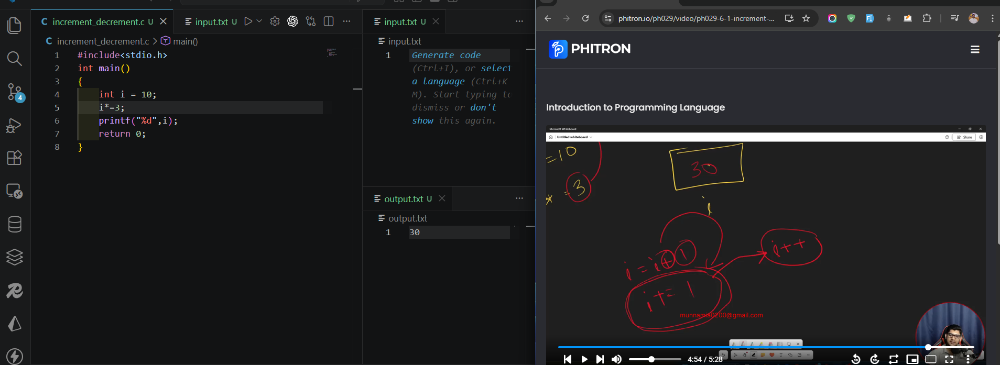
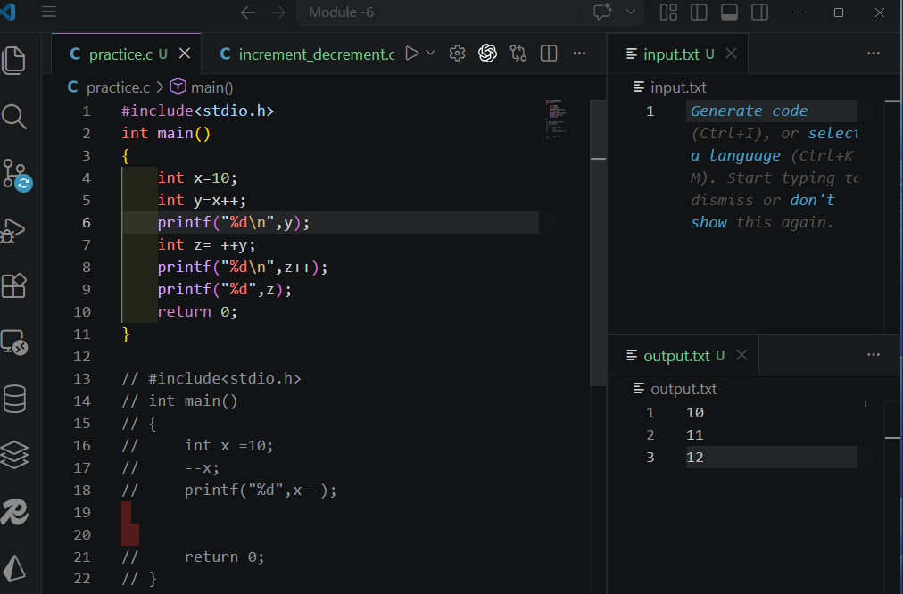

MODULE-6-PROBLEM-SOLVING-WITH-LOOP

## 6-1 Increment Decrement operator



## 6-2 Pre and post increment
- pre increment or decrement its mean first increment or decrement then working
- post increment or decrement its mean first working then increment or decrement 



```c
#include<stdio.h>
int main()
{
    int x=10;
    int y=x++;
    printf("%d\n",y);
    int z= ++y;
    printf("%d\n",z++);
    printf("%d",z);
    return 0;
}

// #include<stdio.h>
// int main()
// {
//     int x =10;
//     --x;
//     printf("%d",x--);
 
  
//     return 0;
// }
```